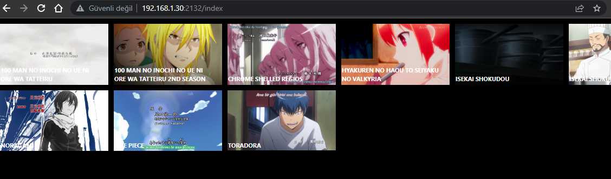
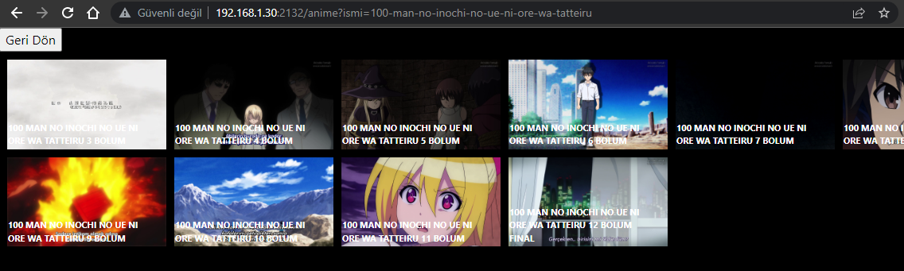

# anime-watching-web
video player powered by artplayer.js

# Setup

1. composer.exe install
2. Throw your folder in the videos folder
3. Automatic pictures are created in the images folder each picture is taken from the 60th second of the video

# Preview

